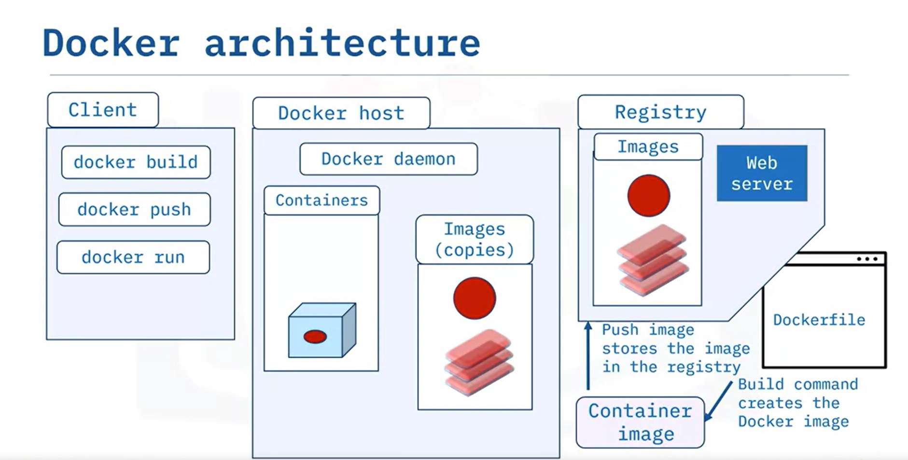
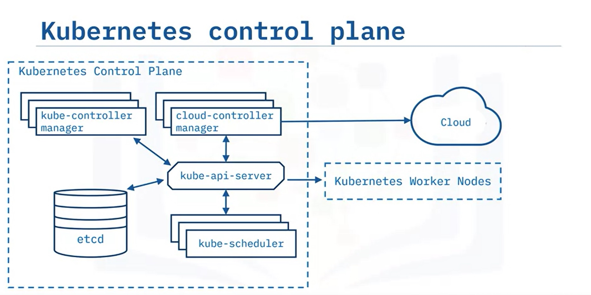
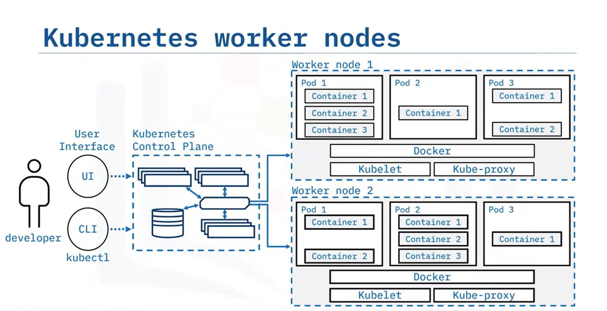
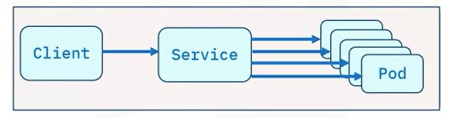
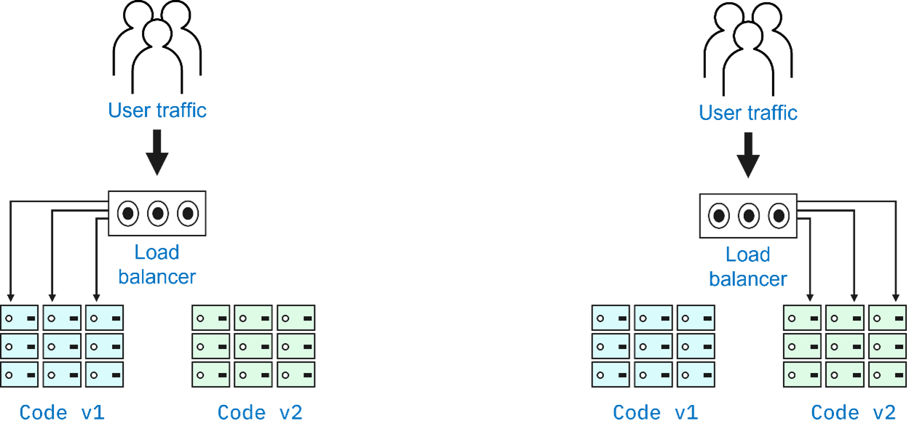
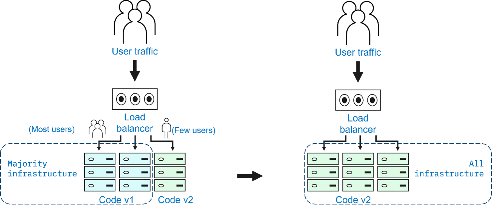
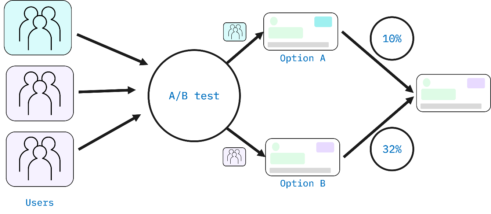
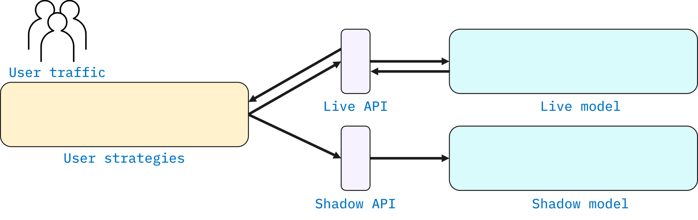
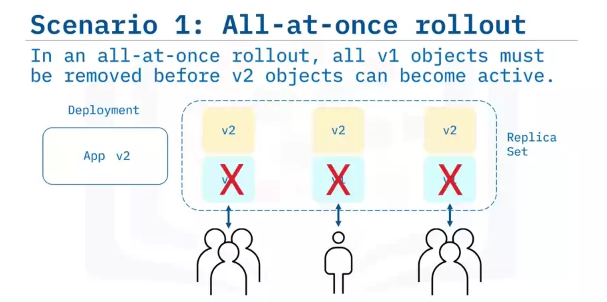
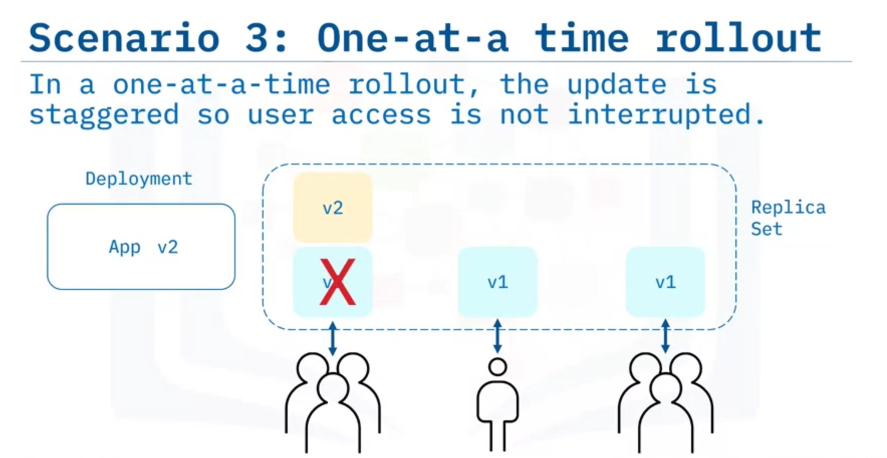

# IBM DevOps and Software Engineering Professional Certificate: Introduction to Containers w/ Docker, Kubernetes & OpenShift

These are my notes of the course [Introduction to Containers w/ Docker, Kubernetes & OpenShift](https://www.coursera.org/learn/ibm-containers-docker-kubernetes-openshift?specialization=devops-and-software-engineering).

I have some related repositories in which I compile a guide on Docker; this course is supposed to focus on Kubernetes.

- [udemy-docker-mastery](https://github.com/mxagar/udemy-docker-mastery)
- [tool_guides/docker_swarm_kubernetes](https://github.com/mxagar/tool_guides/tree/master/docker_swarm_kubernetes)
- [computer_vision_udacity/02_Cloud_Computing/IBM_Cloud_Notes.md](https://github.com/mxagar/computer_vision_udacity/blob/main/02_Cloud_Computing/IBM_Cloud_Notes.md)

In particular, the latter explains how to set up a trial IBM Cloud account with which we can run the exercises from this course. Otherwise, the environment provided in the course can be used, too.

Table of contents:

- [IBM DevOps and Software Engineering Professional Certificate: Introduction to Containers w/ Docker, Kubernetes \& OpenShift](#ibm-devops-and-software-engineering-professional-certificate-introduction-to-containers-w-docker-kubernetes--openshift)
  - [1. Introduction: Docker Containers](#1-introduction-docker-containers)
    - [1.1 First Example: Build, Run, Pull, Push](#11-first-example-build-run-pull-push)
    - [1.2 Docker objects](#12-docker-objects)
    - [1.3 Docker Architecture](#13-docker-architecture)
    - [1.4 Exercises](#14-exercises)
      - [First interaction](#first-interaction)
      - [Building the image](#building-the-image)
      - [Running the image](#running-the-image)
      - [Push image to IBM Cloud Registry](#push-image-to-ibm-cloud-registry)
      - [Cheatsheet](#cheatsheet)
  - [2. Setup and Installation](#2-setup-and-installation)
    - [2.1 Installation of Docker on WSL 2](#21-installation-of-docker-on-wsl-2)
    - [2.2 Install Databases on WSL 2](#22-install-databases-on-wsl-2)
    - [2.3 Creating an IBM Container Registry Namespace](#23-creating-an-ibm-container-registry-namespace)
  - [3. Kubernetes Basics](#3-kubernetes-basics)
    - [3.1 Kubernetes Architecture](#31-kubernetes-architecture)
    - [3.2 Kubernetes Objects](#32-kubernetes-objects)
    - [3.3 Kubernetes CLI: `kubectl`](#33-kubernetes-cli-kubectl)
      - [Common Commads](#common-commads)
    - [3.4 Exercises](#34-exercises)
      - [Connect to Cluster and Create a Pod with Imperative Commands](#connect-to-cluster-and-create-a-pod-with-imperative-commands)
      - [Create a Pod with Imperative Object Configuration](#create-a-pod-with-imperative-object-configuration)
      - [Create a Pod with a Declarative Command](#create-a-pod-with-a-declarative-command)
      - [Load Balancing the Application](#load-balancing-the-application)
  - [4. Managing Applications with Kubernetes](#4-managing-applications-with-kubernetes)
    - [4.1 ReplicaSet](#41-replicaset)
    - [4.2 Autoscaling](#42-autoscaling)
    - [4.3 Deployment Strategies](#43-deployment-strategies)
    - [4.4 Rolling Updates](#44-rolling-updates)
    - [4.5 ConfigMaps and Secrets](#45-configmaps-and-secrets)
      - [Secrets](#secrets)
  - [Extra: Kubernetes Tips](#extra-kubernetes-tips)

## 1. Introduction: Docker Containers

Benefits of containers:

- Apps and microservices encapsulated.
- Containers are platform independent.
- Scaling possible.
- Microservice applications become much easier.
- etc.

Docker / Containers are not the best option if:

- We need high performance
- The architecture is monolithic
- We have rich GUI features
- The app is a very limited desktop app

Concepts:

- Image
- Container: runnable instance of an image
- Dockerfile: image specification file
- Namespace: isolated workspace, where containers run
- Registries

### 1.1 First Example: Build, Run, Pull, Push

`Dockerfile`:

```Dockerfile
# Base image
FROM alpine
# Command
CMD ["echo", "Hello World!"]
```

Building and running:

```bash
# Build
# -t: tag
# my-app: repository
# v1: version
docker build -t my-app:v1

# Get all images
docker images

# Create/Run container
docker run my-app:v1

# Get running containers
docker ps -a

# Push images to a registr we're logged in, i.e., configured
docker push my-app:v1

# Retrive images from configured registries
docker pull nginx
```

### 1.2 Docker objects

Dockerfile:

```Dockerfile
# Common commads
FROM # base image
RUN # execute commands
CMD # default command for execution
```

Docker images:

- Instructions to build a container
- Composed by layers added sequentuially; when image is changed, only the layers on the top of the change are modified.

Image name:

```
hostname/repository:tag
docker.io/ubuntu:18.04
```

Other objects:

- Networks are used for isolated container communications
- Storage: volumes are used for persisting data after container stops
- Plugins: connect to external platforms

### 1.3 Docker Architecture

- Interaction via CLI, REST API or GUI
- Docker host server has the docker daemon: `dockerd`
  - It is distirbuted: the host server and the execution don't need to be on the same physical machine
- Daemon listens to interactions
- Daemon executes the commands
- Registry stores images: public, private



### 1.4 Exercises

An environment is generated with a Terminal.

The working directory contains a simple Node.js application that we will run in a container. The app will print a hello message along with the hostname. The following files are needed to run the app in a container:

- `app.js` is the main application, which simply replies with a hello world message.
- `package.json` defines the dependencies of the application.
- `Dockerfile` defines the instructions Docker uses to build the image.

I have replicated the folder in [`lab/01_ContainersAndDocker/`](./lab/01_ContainersAndDocker/), so the exercise can be carried out locally instead of using the provided environment. Also, note that [`IBM_Cloud_Notes.md`](https://github.com/mxagar/computer_vision_udacity/blob/main/02_Cloud_Computing/IBM_Cloud_Notes.md) explains how to set up an IBM Cloud account to use a Registry.

Here are the contents of the `Dockerfile` and the `app.js`:

```Dockerfile
FROM node:9.4.0-alpine
COPY app.js .
COPY package.json .
RUN npm install &&\
    apk update &&\
    apk upgrade
EXPOSE  8080
CMD node app.js
```

```javascript
var express = require('express')
var os = require("os");
var hostname = os.hostname();
var app = express()

app.get('/', function(req, res) {
  res.send('Hello world from ' + hostname + '! Your app is up and running!\n')
})
app.listen(8080, function() {
  console.log('Sample app is listening on port 8080.')
})
```

#### First interaction

```bash
docker --version
ibmcloud version
cd /home/project
# Clone a repository
[ ! -d 'CC201' ] && git clone https://github.com/ibm-developer-skills-network/CC201.git
cd CC201/labs/1_ContainersAndDocker/
ls # app.js  Dockerfile  package.json
docker pull hello-world
docker images # now, image is there
docker run hello-world
docker ps -a # containers with IDs
docker container rm <container_id> # f36c514edcd4
docker ps -a # container not there anymore
```

#### Building the image

```bash
# Build the image
docker build . -t myimage:v1
# Check image is there
docker images # base images appear, too
```

#### Running the image

```bash
docker run -dp 8080:8080 myimage:v1
curl localhost:8080
# Hello world from 0c0a10807bfd! Your app is up and running!

# Stop all running containers
docker stop $(docker ps -q)
# Check nothing is running
docker ps
```

#### Push image to IBM Cloud Registry

We have a custom (automatically generated IBM Cloud account).

```bash
# Check we're logged in
ibmcloud target

# Check namespaces we have access to
ibmcloud cr namespaces

# Set namespace region
ibmcloud cr region-set us-south

# Log local docker to IBM Cloud Container Registry to pull/push
ibmcloud cr login

# Create namespace env variable
export MY_NAMESPACE=sn-labs-$USERNAME

# Tag image befoe pushing
docker tag myimage:v1 us.icr.io/$MY_NAMESPACE/hello-world:1

# Push to registry the tagged image
docker push us.icr.io/$MY_NAMESPACE/hello-world:1

# Check the image is in the registry
ibmcloud cr images

# To view only images in my namespace
ibmcloud cr images --restrict $MY_NAMESPACE
```

#### Cheatsheet

Also, check my summary: [`docker_commands_summary.txt`](./docker_commands_summary.txt).

```bash
curl localhost 	# Pings the application.
docker build 	# Builds an image from a Dockerfile.
docker build . -t 	# Builds the image and tags the image id.
docker CLI 	# Start the Docker command line interface.
docker container rm # Removes a container.
docker images 	# Lists the images.
docker ps 	# Lists the containers.
docker ps -a 	# Lists the containers that ran and exited successfully.
docker pull 	# Pulls the latest image or repository from a registry.
docker push 	# Pushes an image or a repository to a registry.
docker run 	# Runs a command in a new container.
docker run -p 	# Runs the container by publishing the ports.
docker stop 	# Stops one or more running containers.
docker stop $(docker ps -q) 	# Stops all running containers.
docker tag 	# Creates a tag for a target image that refers to a source image.
docker –version 	# Displays the version of the Docker CLI.
exit 	# Closes the terminal session.

export MY_NAMESPACE 	# Exports a namespace as an environment variable.
ibmcloud cr images 	# Lists images in the IBM Cloud Container Registry.
ibmcloud cr login 	# Logs your local Docker daemon into IBM Cloud Container Registry.
ibmcloud cr namespaces 	# Views the namespaces you have access to.
ibmcloud cr region-set 	# Ensures that you are targeting the region appropriate to your cloud account.
ibmcloud target 	# Provides information about the account you’re targeting.
ibmcloud version 	# Displays the version of the IBM Cloud CLI.
```

## 2. Setup and Installation

Most of this section was done by myself, it's not included in the course.

Check: [tool_guides/docker_swarm_kubernetes](https://github.com/mxagar/tool_guides/tree/master/docker_swarm_kubernetes).

### 2.1 Installation of Docker on WSL 2

Links, sources:

- [Install Docker in WSL 2 without Docker Desktop](https://www.youtube.com/watch?v=SDk3pqFXgs8)

### 2.2 Install Databases on WSL 2

Even though relational databases are not related to Docker/Kubernetes, many apps require the usage of an SQL database. Therefore, I describe here how this is done.

Links, sources:

- [Get started with databases on Windows Subsystem for Linux](https://learn.microsoft.com/en-us/windows/wsl/tutorials/wsl-database)
- [Set up PostgreSQL on WSL2 and Access with pgAdmin on Windows](https://chloesun.medium.com/set-up-postgresql-on-wsl2-and-connect-to-postgresql-with-pgadmin-on-windows-ca7f0b7f38ab)

### 2.3 Creating an IBM Container Registry Namespace

A namespace is a slice of a registry to which you can push your images. We can create an IBM Cloud account and create a namespace in the Container Registry tool/service.

Check my notes at [computer_vision_udacity/02_Cloud_Computing/IBM_Cloud_Notes.md](https://github.com/mxagar/computer_vision_udacity/blob/main/02_Cloud_Computing/IBM_Cloud_Notes.md).

Also, there might be a symbolic link in the local cloned folder: [`IBM_Cloud_Notes.md`](./IBM_Cloud_Notes.md).

## 3. Kubernetes Basics

Kubernetes (aka. k8s) is the most popular and nowadays standard container orchestration system; other orchestration tools:

- Docker Swarm
- Marathon
- Nomad

Container orchestration is needed when we have several containers to build one app (several services). Orchestration handles the entire lifecycle of all the containers:

- Definition of the image locations in the registry
  - New container deployments are automatically scheduled
- Provisionining and Deployment
- Management
  - System parameters are controlled
  - File parameters too
- Scaling and load balancing
- Networking: secure
- Availability is assured
- Rolling updates or roll backs
- Health checks can be done

Typically, a configuration file in `YAML` or `JSON` is used.

Kubernetes **is not**

- a PaaS
- limited to Docker

Important Kubernetes concepts:

- Pods and workloads: smallest deployable compute object and the higher-level abstractions to run workloads.
- Services: applications running on sets of Pods.
- Storage: persistent and temporary storage for pods.
- Configuration: pod configuration.
- Security: for pod and API access.
- Policies: for groups so that pods can be found and managed.
- Schedule, Eviction: run/terminate pods depending on resources.
- Preemption: termination of pods if low priority so that others can run on nodes.
- Administration: Kubernetes cluster administration.
- Secrets: sensitive information storage and management (SSH keys, etc.).
- Self-healing: restarts/replaces pods if necessary
- Service discovery and load balancing: pods are discovered by IP or DNS.

Kubernetes ecosystem: many tools and providers.

### 3.1 Kubernetes Architecture

The following two images show the architecture of a **Kubernetes deployment**, also known as a **Kubernetes cluster**. Such a cluster is a deployment of an application which runs several containers arranged as we define.





From the images:

- The user interacts with the **Kubernetes Control Plane** via an UI or the `kubectl` CLI.
- The **Kubernetes Control Plane** controls and maintains the desired cluster state, e.g., monitoring of resources, scaling if necessary, etc.; it has these components:
    - `kube-api-server`: main API used by all components, like the front-end for k8s.
    - `etcd`: databse which stores cluster state and configuration data.
    - `kube-scheduler`: assigns created pods to nodes (considering resources, scheduling, etc.).
    - `kube-controller-manager`: monitors cluster state and assures it has the desired one.
    - `cloud-controller-manager`: controlers that interact with the underlying cloud provider. Kubernetes is Open Source and all cloud providers have an interface with it.
- Nodes = Worker machines. They can be virtual or physical. They are not created by Kubernetes, but by the cloud provider! They are managed by the control plane.
- Pods: are run in nodes; a pod is the smallest deployment entity and can contain several containers.
- Containers share the resources of the node and can communicate among themselves.
- `Kubelet`: it is a process running on each node which communicates with the `kube-api-server`; it ensures that the pods are running.
- Container runtime = Docker: it downloads the images and runs the containers. Usually Docker is employed but there are other options, too.
- `Kube-proxy`: it handles comms between pods, from within or outside.

### 3.2 Kubernetes Objects

Terminology:

- Object: something with **identity**, **state** and **behavior**.
- Entity: thing with identity and data.
- Persistent: which lasts.

Kubernetes objects are **persistent entities**; examples:

- Pods
- Namespaces
- ReplicaSets
- Deployments

Kubernets objects consist of two main fields:

- Object spec: desired state defined by user
- Status: current state

K8s works by trying to match the current state with the desired state.

Objects have:

- Labels: non-unique key-value pairs used for identification.
- Label selectors: used to group objects by their labels.

**Namespaces**: mechanims to isolate groups of resources in a single cluster.

**Pods**:

- Simplest unit in k8s
- A process running
- Encapsulates one or more containers
- We can replicate a Pod to scale it horizontally
- They are defined with a YAML, similar to the `docker-compose.yaml`.

```yaml
apiVersion: v1
kind: Pod
metadata:
  name: nginx
spec:
  containers:
  - name: nginx
    image: nginx:1.7.9
    ports:
    - containerPort: 80
```

**ReplicaSet**: horizontally scaled and identical running pods.

- Also defined in a YAML; we have the number of `replicas` and a Pod `template` definition in it.
- Creating ReplicaSets directly is not recommended; instead, we should create a **Deployment**, which is a higher level concept that manages ReplicaSets.

```yaml
apiVersion: apps/v1
kind: ReplicaSet
metadata:
  name: nginx-replicaset
  labels:
    app: nginx
spec:
  replicas: 3
  selector:
    matchLabels: # Pods with this label can be acquired
      app: nginx
  template:
    metadata:
      labels:
        app: nginx # must match matchLabels
    spec:
      containers:
      - name: web-server
        image: nginx:1.7.9
        ports:
        - containerPort: 80
```

A **Deployment** is a higher-level object which can handle/update Pods and ReplicaSets:

- We should use it instead of Pod/ReplicaSet definitions.
- It is suitable for stateless applications.

```yaml
apiVersion: apps/v1
kind: Deployment
metadata:
  name: nginx-deployment
  labels:
    app: nginx
spec:
  replicas: 3
  selector:
    matchLabels: # Pods with this label can be acquired
      app: nginx
  template:
    metadata:
      labels:
        app: nginx # must match matchLabels
    spec:
      containers:
      - name: web-server
        image: nginx:1.7.9
        ports:
        - containerPort: 80
```

A **Service** is a logical abstraction for sets of pods which can be accessed with an IP address. It is used because Pods are volatile (i.e., we can destroy and run them as we please), but the Service interface (with its IP) remains for the user/other components of the cluster. Properties:

- They are REST objects
- They facilitate the access to the Pods
- They keep track of Pod changes
- They act as a load balances across the pods
- They are assigned a unique IP address
- They support multiple protocols: TCP, UDP
- They suppor multiple ports
- They can map incoming ports to a tergtPort



There are four **types of services**:

- **ClusterIP**
  - Default, most common
  - Service has an IP reachable only within the cluster
    - Pods within cluster can communicate with Service
    - Pods outside cluster cannot access Service
  - We can set the IP in the service definition file
- **NodePort**
  - Extension of ClusterIP
  - It exposes the Service on each node's IP address at a static port
  - Then, comms are routed to the Service ClusterIP
  - Not recommended for production, due to security issues
- **External LoadBalancer (ELB)**
  - Extension of NodePort
  - It creates ClusterIPs and NodePorts first
  - Then, there is a load balancer which is the interface with the outside world
  - The load balancer routes outside comms to the corresponding NodePorts
  - Cloud providers have an ELB which can be used to expose our services to the internet
- **External Name**
  - DNS name mapped to a Service via the ELB
  - Used for external storage

Related to a **service**, we have these additional objects:

- **Ingress** is an API object which enables access/routing to Services from outside. Applications are exposed to the Internet on port 80 (HTTP) or 443 (HTTPS).
  - Difference to ELB: ELB is expensive and managed outside the cluster, while Ingress is cheaper and managed by the cluster.
- **DeamonSet** is an object which makes sure a Node runs a copy of a Pod, or it garbage-collects them when they are not necessary.
  - Note that use user adds/removes Pods to/from the cluster, but DeamonSet maps them to the Nodes.
  - If we delete a DeamonSet, all its Pods are removed.
  - They are used for monitoring Nodes, storage or logs.
- **StatefulSet** is an object which manages stateful applications.
  - It manages the deployment and scaling of pods.
  - It maintains a *sticky identity* for each Pod
  - It provides persistent storage volumes
- **Job** is an object which creates Pods
  - It tracks the creation process completion
  - Jobs are retried until completed
  - Suspeding a job deletes its active Pods
  - Can run several jobs in parallel
  - *CronJob*: regular jobs with an iterative schedule

### 3.3 Kubernetes CLI: `kubectl`

Kube-control = `kubectl` = Kubernetes (k8s) CLI.

```bash
# kubectl usage pattern/structure: order matters
kubectl [command] [type] [name] [flags]

# command: operation; create, get, apply, delete
# type: resource; pod, deployment, replicaset
# name: resource name, if applicable
# flags: options, modifiers to override default values
```

It has 3 command types:

1. Imperative commands: we can create/update/delete objects with a command, but we don't keep track/document the operation (so we lack of reproducibility if the entire command is not saved in a file), and they are limited.

    kubectl run nginx --image nginx

2. Imperative object configuration: we specify the operation and its flags in the command, but the objects configuration in a YAML config file passed to the command. We can save in a git repo the config file, so the reproducibility is better.

    kubectl create -f nginx.yaml

3. Declarative object configuration: in this option, the operations and their options are also in a YAML. So, everything is in a YAML. This is the best option: we define a desired state and k8s actualizes it.

    kubectl apply -f nginx/

#### Common Commads

```bash
kubectl version 	# Prints the client and server version information. 

kubectl run 	# Creates and runs a particular image in a pod.

kubectl get 	# Displays resources.
kubectl get services 	# Lists the services created.
kubectl get pods 	# Lists all the Pods in the current namespace
kubectl get pods -o wide 	# Lists all the Pods with details.
kubectl get pods --all-namespaces	# Lists all the Pods.

kubectl apply  # Applies a configuration to a resource.
kubectl apply -f ./my1.yaml -f ./my2.yaml
kubectl apply -f https://git.io/vPieo

kubectl scale --replicas=3 rs/foo # scale
kubectl scale --replicas=3 -f foo.yaml

kubectl get deployments 	# Lists the deployments created.

kubectl config get-clusters 	# Displays clusters defined in the kubeconfig.
kubectl config get-contexts 	# Displays the current context.
kubectl create 	# Creates a resource.
kubectl delete 	# Deletes resources.
kubectl describe 	# Shows details of a resource or group of resources.
kubectl expose 	# Exposes a resource to the internet as a Kubernetes service.
kubectl proxy 	# Creates a proxy server between a localhost and the Kubernetes API server.
```

### 3.4 Exercises

An environment is generated with a Terminal.

The working directory contains the same simple Node.js application that we will run in a container/Pod. The app will print a hello message along with the hostname. The following files are needed to run the app in a container/Pod:

- `app.js` is the main application, which simply replies with a hello world message.
- `package.json` defines the dependencies of the application.
- `Dockerfile` defines the instructions Docker uses to build the image.
- `hello-world-create.yaml`: YAML for imperative configuration command.
- `hello-world-apply.yaml`: YAML for declarative configuration command.

I have replicated the folder in [`lab/02_IntroKubernetes/`](./lab/02_IntroKubernetes/), so the exercise can be carried out locally instead of using the provided environment. However, in the environment we have already a cluster set up

Also, note that [`IBM_Cloud_Notes.md`](https://github.com/mxagar/computer_vision_udacity/blob/main/02_Cloud_Computing/IBM_Cloud_Notes.md) explains how to set up an IBM Cloud account.

To recap, here are the contents of the `Dockerfile` and the `app.js`:

```Dockerfile
FROM node:9.4.0-alpine
COPY app.js .
COPY package.json .
RUN npm install &&\
    apk update &&\
    apk upgrade
EXPOSE  8080
CMD node app.js
```

```javascript
var express = require('express')
var os = require("os");
var hostname = os.hostname();
var app = express()

app.get('/', function(req, res) {
  res.send('Hello world from ' + hostname + '! Your app is up and running!\n')
})
app.listen(8080, function() {
  console.log('Sample app is listening on port 8080.')
})
```

#### Connect to Cluster and Create a Pod with Imperative Commands

```bash
kubectl version
# Major:"1", Minor:"25", GitVersion:"v1.25.9"

# Clone project files - NOT necessary locally
[ ! -d 'CC201' ] && git clone https://github.com/ibm-developer-skills-network/CC201.git
cd CC201/labs/2_IntroKubernetes/
ls
# app.js  Dockerfile  hello-world-apply.yaml  hello-world-create.yaml  package.json

# Get cluster information
kubectl config get-clusters
# labs-prod-kubernetes-sandbox/c8ana0sw0ljj8gkugn50

# A context is a group of access parameters,
# including a cluster, a user, and a namespace.
# View your current context
kubectl config get-contexts

# List all the Pods in your namespace
kubectl get pods

# Export namesace as env variable
export MY_NAMESPACE=sn-labs-$USERNAME

# Build and push the image
docker build -t us.icr.io/$MY_NAMESPACE/hello-world:1 . && docker push us.icr.io/$MY_NAMESPACE/hello-world:1

# Run the hello-world image as a container in Kubernetes
# --overrides option here enables us to specify the needed credentials to pull this image from IBM Cloud Container Registry
# This is an imperative command
kubectl run hello-world --image us.icr.io/$MY_NAMESPACE/hello-world:1 --overrides='{"spec":{"template":{"spec":{"imagePullSecrets":[{"name":"icr"}]}}}}'

# List the Pods in your namespace
kubectl get pods
kubectl get pods -o wide

# Describe the Pod to get more details about it
# A lot of info is shown: Pod, container, etc.
kubectl describe pod hello-world

# Delete the Pod; when done, check it's gone
kubectl delete pod hello-world
kubectl get pods
```

#### Create a Pod with Imperative Object Configuration

This exercise continues where the previous ended.

Instead of running the Pod with an imperative and manual command, we can define the Pod configuration in `hello-world-create.yaml` and launch it imperatively. This has the advantage that the configuration is persisted in the YAML, so we can use version control.

`hello-world-create.yaml`:

```yaml
apiVersion: v1
kind: Pod
metadata:
  name: hello-world
spec:
  containers:
  - name: hello-world
    # The namespace needs to be edited: sn-labs-mxagar
    image: us.icr.io/<my_namespace>/hello-world:1
    ports:
    - containerPort: 8080
  imagePullSecrets:
  - name: icr
```

```bash
# Create Pod: Imperative configuration
kubectl create -f hello-world-create.yaml

# Check it's there
kubectl get pods

# Delete it and check
kubectl delete pod hello-world
kubectl get pods
```

#### Create a Pod with a Declarative Command

This exercise continues where the previous ended.

Instead of running the Pod with an imperative configuration, we can define the Pod and command configuration in `hello-world-apply.yaml`, so we use a declarative command style. This has the advantage that everything is persisted in the YAML, so we can use version control.

`hello-world-apply.yaml`:

```yaml
apiVersion: apps/v1
kind: Deployment
metadata:
  generation: 1
  labels:
    run: hello-world
  name: hello-world
spec:
  replicas: 3
  selector:
    matchLabels:
      run: hello-world
  strategy:
    rollingUpdate:
      maxSurge: 1
      maxUnavailable: 1
    type: RollingUpdate
  template:
    metadata:
      labels:
        run: hello-world
    spec:
      containers:
        # The namespace needs to be edited: sn-labs-mxagar
      - image: us.icr.io/<my_namespace>/hello-world:1
        imagePullPolicy: Always
        name: hello-world
        ports:
        - containerPort: 8080
          protocol: TCP
        resources:
          limits:
            cpu: 2m
            memory: 30Mi
          requests:
            cpu: 1m
            memory: 10Mi   
      imagePullSecrets:
      - name: icr
      dnsPolicy: ClusterFirst
      restartPolicy: Always
      securityContext: {}
      terminationGracePeriodSeconds: 30
```

```bash
# Create Pod: Declarative command
# Kubernetes automatically creates a deployment
# with 3 pod replicas
kubectl apply -f hello-world-apply.yaml

# Check it's there
kubectl get deployments
kubectl get pods

# If we delete one pod, a new one will be created
# since the current state will be modified to match the desired
# state with 3 replicas
# Replace <pod_name> with a valid name obtained with 
# kubectl get pods
kubectl delete pod <pod_name> && kubectl get pods

# Wait and check we return to having 3 pods
kubectl get pods
```


#### Load Balancing the Application

This exercise continues where the previous ended.

We have a deployment and we want to expose it to the internet using a load balancer.

```bash
# This command creates what is called a ClusterIP Service.
# This creates an IP address that accessible within the cluster.
kubectl expose deployment/hello-world
# service/hello-world exposed

# Get services, with their ClusterIP
kubectl get services
# ... 172.21.87.140

# Split the Terminal: Temrinal > Split Terminal
# This assures that the environment variables are kept
# Now in the new terminal, we create a proxy.
# Note that a ClusterIP is not accessible from outside,
# but a proxy makes that possible.
# HOWEVER, we never do it so in a production environment.
kubectl proxy
# Starting to serve on 127.0.0.1:8001
# Now, we need to keep this window open
# When we finish, close it with Ctrl+C

# In the first Terminal, ping the app
curl -L localhost:8001/api/v1/namespaces/sn-labs-$USERNAME/services/hello-world/proxy
# Hello world from hello-world-5475f58c99-4sl8j! Your app is up and running!

# Note that the output includes the Pod name
# if we run it in a loop, the load balancer will route
# the request to different Pods
for i in `seq 10`; do curl -L localhost:8001/api/v1/namespaces/sn-labs-$USERNAME/services/hello-world/proxy; done
# Hello world from hello-world-5475f58c99-5h8qq! Your app is up and running!
# Hello world from hello-world-5475f58c99-5h8qq! Your app is up and running!
# Hello world from hello-world-5475f58c99-5h8qq! Your app is up and running!
# Hello world from hello-world-5475f58c99-4sl8j! Your app is up and running!
# Hello world from hello-world-5475f58c99-5h8qq! Your app is up and running!

# Delete the deployment and the service
kubectl delete deployment/hello-world service/hello-world

# Close the proxy with Ctrl+C
# in the second Terminal
```

## 4. Managing Applications with Kubernetes

### 4.1 ReplicaSet

ReplicaSets are Pod sets; in contrast to a ReplicaSet a single Pod **cannot**:

- Accomodate growing demans
- Handle outages
- Minimize downtime (with redundant executions)
- Auto restart on interruptions

A ReplicaSet:

- Add or deletes Pods for scaling or redundancy
- Replaces failing Pods or deletes additional Pods to maintain the desired state
- Should be used instead of a ReplicaController (older)

Notes:

- A ReplicaSet is best managed by a Deployment, i.e., we launch a Deployment, which creates ReplicaSets automatically, which contain Pods.
- A ReplicaSet doesn't own the Pods, it uses Pod labels to decide which Pods ti acquire to bring a deployment to a desired state. **In general, in Kubernetes objects are independent, not owned by other objects.**

Example: `hello-kubernetes.yaml`:

```yaml
apiVersion: apps/v1
kind: Deployment
metadata:
  name: hello-kubernetes
spec:
  selector:
    matchLabels: # Pods with this label can be acquired
      app: hello-kubernetes
  template: # Label of pod candiates to add/delete
    metadata:
      labels:
        app: hello-kubernetes # must match matchLabels
    spec:
      containers:
      - name: hello-kubernetes
        image: username/hello-kubernetes:1.5
        ports:
        - containerPort: 8080
```

If we start the deployment above:

```bash
# Declarative deployment
kubectl apply -f hello-kubernetes.yam

# Deployment: hello-kubernetes
kubectl get deployment

# ReplicaSet: hello-kubernetes-xxx
# In contrast to the Deployments, ReplicaSets and Pods have a number ending 
# ReplicaSet: <deployment>-xxx
# Pod: <deployment>-xxx-yyy
kubectl get replicaset # also: get rs

# Pod: hello-kubernetes-xxx-yyy
kubectl get pods
```

We could also deploy a ReplicaSet, but it's better to deploy a Deployment:

```yaml
apiVersion: apps/v1
kind: ReplicaSet # <- ReplicaSet
metadata:
  name: hello-kubernetes
spec:
  replicas: 1 # <- Number of Pods we want
  selector:
    matchLabels:
      app: hello-kubernetes
...
```

If we deploy a Deployment with a ReplicaSet inside, we can scale it in manually:

```bash
# Deploy: hello-kubernetes
kubectl create -f hello-kubernetes.yaml

# We see one pod: hello-kubernetes-xxx-yyy
# In contrast to the Deployments, ReplicaSets and Pods have a number ending 
# ReplicaSet: <deployment>-xxx
# Pod: <deployment>-xxx-yyy
kubectl get pods

# Info of the deployment
kubectl get deploy

# Scale: 3 Pods
# With this command we change the desired state
kubectl scale deploy hello-kubernetes --replicas=3

# Check we have 3 Pods: hello-kubernetes-xxx-yyy
kubectl get pods

# We can delete one Pod: hello-kubernetes-xxx-yyy
# Since the desired states is of 3 Pods, another one will be generated automatically
kubectl delete pod hello-kubernetes-xxx

# Check we have indeed 3 Pods: hello-kubernetes-xxx-yyy
kubectl get pods

# Similarly, if we create a Pod, it is deleted to match the desired state of 3!
kubectl create pod hello-kubernetes-xxx-yyy

# Check we have indeed 3 Pods: hello-kubernetes-xxx-yyy
kubectl get pods
```

### 4.2 Autoscaling

In the previous section we either decined the number of Pods or manually scaled them; however, it's better to scale as needed! Kubernetes allows autoscaling at two layers: (1) Cluster/node level and (2) Pod level, which means in practice that we have three types of autoscalers available:

- Horizontal Pod Autoscaler (HPA): increase/decrease the number of Pods
- Vertical Pod Autoscaler (VPA): inrease/decrease resource size (RAM) or speed of the Pods (CPU)
- Cluster Autoscaler (CA): adjust number of nodes (VMs), where Pods are added/removed

A typical use-case/scenario is an application which is differently consumed during the day, depending on whether people are working, eating, sleeping. Usually, a combination of the three is used.

Examples: 

```bash
# hello-kubernetes-xxx-yyy
kubectl get pods

# hello-kubernetes-xxx
kubectl get rs

# Autoscaling: minimum Pods 2, max 5, when CPU usage passes 50%, add/delete Pod
# We can also specify that in the specs of the YAML
kubectl autoscale deploy hello-kubernetes --min=2 --max=5 --cpu-percent=50

# Get specs for the HPA: minpods, maxpods, etc.
kubectl get hpa
```

### 4.3 Deployment Strategies

A deployment strategy defines:

- how to deploy ReplicaSets, Pods, etc.
- when to pause/resume Deployments
- when and how scale Deployments.

We have these types of Deployment Strategies:

1. **Recreate Strategy**: when the app is terminated and a new version of the app is deployed.
    - It's the simplest.
    - There's a downtime.

2. **Rolling (ramped) Strategy**: each Pod is updated one at a time, i.e., every single v1 Pod is terminated and replaced by a v2 sequentially.
    - No downtime.

3. **Blue/Green Strategy**: we have two live versions v1 and v2 of the application (in two different environments) and the load balancer switches the traffic to v2 when it passes all the tests.
    - Instantaneous, no downtime.
    - Expensive: it requires double the resources.

    

4. **Canary Strategy**: the new version v2 is tested by a subset of users; when successful, it is rolled out to all users.
    - More complex, gradual.
    - No downtime.

    

5. **A/B Testing Strategy**: used to evaluate two versions of an application; a subset of the users is randomly redirected to v1, whereas the rest to v2. Pre-defined metrics are measured.
    - Requires a specific load balancer.

    

6. **Shadow Strategy**: two versions are deployed, a live model and a *shadow* model; the difference is that the *shadow* model doesn't send back the responses to the user. The idea is to measure the app performance without interrupting the user experience.
    - Complex.
    - ??

    

### 4.4 Rolling Updates

Rolling updates = automated updates that occur on a schedules basis.

We distinguish:

- Roll out: a new version is deployed.
- Roll back: the new version is removed and the old re-deployed.

We can specify how to perform the rolling updates in the YAML file, i.e., any parameters we want.

Practical, simple example of how to **roll out** anew version:

```bash
# 3 Pods: hello-kubernetes-xxx-yyy
kubectl get pods

# Now, a new version of the code is committed
# Thus, we need to create a new tagged image
docker build -t hello-kubernetes .
dcoker tag hello-kubernetes username/hello-kubernetes:2.0
docker push username/hello-kubernetes:2.0

# Check the deployment: hello-kubernetes
kubectl get deployments

# Roll out: Set the new image tag
# 3 new pods will be rolled out
kubectl set image deployments/hello-kubernetes hello-kubernetes=username/hello-kubernetes:2.0

# Check the rollout: we should get "successfully rolled out"
kubectl rollout status deployments/hello-kubernetes

# Roll back if something is wrong
kubectl rollout undo deployments/hello-kubernetes

# Check Pods: we should see
kubectl get pods
```

Following the patterns introduced in the Deployment Strategies, we have different roll oy/back scenarios:

1. All-at-once rollout: all v1 objects removed and v2 objects become active; example above. There is a lag while terminating v1 and until v2 is up.
2. All-at-once rollback: equivalent to the previous, but v1 is re-deployed.
3. Once-at-a-time rollout: v1 Pods are replaced one by one by v2 Pods. There is no lag, no downtime/interruption.
4. Once-at-a-time rollback: equivalent to the previous, but v1 is re-deployed one by one.





### 4.5 ConfigMaps and Secrets

Configuration parameters should not be hard-coded. ConfigMap is an API which stores key-value pairs of non-confidential/secret configuration data (limited to 1 MB):

- It is visible to all the objects.
- It is reusable across deployments.
- We can create it in varios forms: inserting string literals to `kubectl` commands, providing key-value pairs, witha YAML file, etc.

Example: String literal:

```bash
# Here we are creteing a my-config object of type ConfigMap
# and it has a key-value pair: MESSAGE="Hello"
kubectl create ConfigMap my-config --from-literal=MESSAGE="Hello"
```

Once the ConfigMap is created, we need to reference it in the YAML:

```yaml
env:
- name: MESSAGE
  valueFrom:
    configMapKeyRef:
      name: my-config
      key: MESSAGE
```

Example: File with key-value pairs:

```bash
# Here we are creteing a my-config object of type ConfigMap
# and it is sourced from config.txt, contains lines in the form <key>=<value> 
kubectl create ConfigMap my-config --from-file=config.txt

# Show contents of my-config ConfigMap
kubectl describe ConfigMap my-config
```

It is also possible to do it with YAML file which follows the k8s format.

#### Secrets

In contrast to ConfigMaps, Secrets are encrypted. We operate with them in a similar manner:

```bash
# Create secret from string literal: secret name = api-creds
kubectl create secret generic api-creds --from-literal=key=mypassword

# Show secret - content is not displayed, only the name: api-creds
kubectl get secret
kubectl describe secret api-creds

# Output (encrypted) secret
kubectl get secret api-creds -o YAML
```

To use the secret, we need to reference it:

```yaml
env:
- name: API_CREDS
  valueFrom:
    secretKeyRef:
      name: api-creds
      key: key
```

We can also load teh secrets with volume-mounts.

## Extra: Kubernetes Tips

Which is the configuration of a pod in a cluster? (e.g., memory, etc.)

```bash
# Get all pods in the cluster: pick the pod name you want to look into
kubectl --kubeconfig k8s/config --namespace your-env get pods

# Get infos of that pod
kubectl --kubeconfig k8s/config --namespace your-env describe pod pod-name-xxx
```

